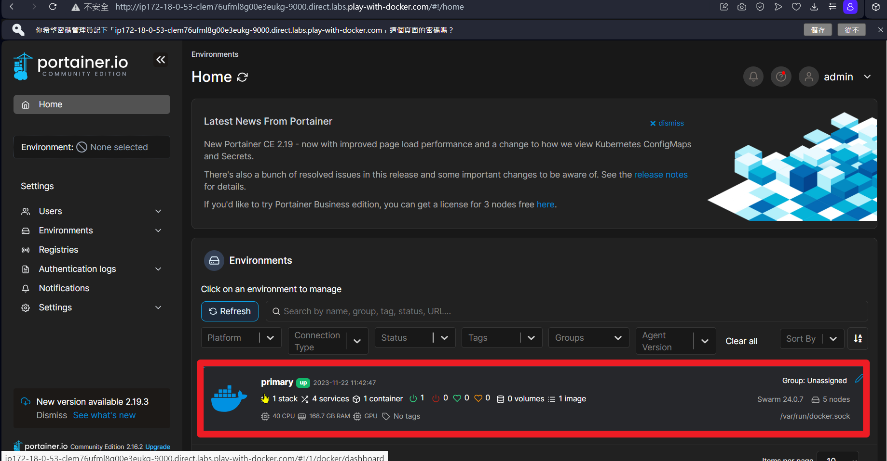

# Redis Cluster in Docker Stack (slave and sentinel mode)


## 環境
 * docker-playground (https://labs.play-with-docker.com/)
 * Templates: 3 Managers and 2 Workers


## 建立 swarm 叢集
 * 略


## 建立 Overlay Network
```shell
docker network create -d overlay --attachable redis-net
```

## 建立 Docker stack
```shell
docker stack deploy -c docker-stack-redis.yml redis
```

## 設定 node label

 * 方法一 - 指令方式
```shell
docker node update --label-add zone=fs manager3
docker node update --label-add zone=fs worker1
docker node update --label-add zone=fs worker2
docker node update --label-add redis-master=true manager3
```

 * 方法二 - Portainer GUI介面操作
   * 查看 portainer 在哪裡，在 manager node 下 `docker stack ps redis`
     ```shell
     ID             NAME                     IMAGE                           NODE       DESIRED STATE   CURRENT STATE              ERROR                              PORTS
     hyuys3he5cv1   redis_portainer.1        portainer/portainer:latest      manager1   Running         Preparing 13 seconds ago                                      
     njx06dxpjui5   redis_redis-master.1     bitnami/redis:latest                       Running         Pending 14 seconds ago     "no suitable node (scheduling …"   
     a7jwu6l9xdjm   redis_redis-sentinel.1   bitnami/redis-sentinel:latest              Running         Pending 13 seconds ago     "no suitable node (scheduling …"   
     ifzd7ppd02om   redis_redis-sentinel.2   bitnami/redis-sentinel:latest              Running         Pending 13 seconds ago     "no suitable node (scheduling …"   
     n7x0uhjhfddb   redis_redis-sentinel.3   bitnami/redis-sentinel:latest              Running         Pending 13 seconds ago     "no suitable node (scheduling …"   
     5a6zu54yrvwq   redis_redis-slave.1      bitnami/redis:latest                       Running         Pending 14 seconds ago     "no suitable node (scheduling …"   
     ljtw745j9vjp   redis_redis-slave.2      bitnami/redis:latest                       Running         Pending 14 seconds ago     "no suitable node (scheduling …"   
     ```
   * 發現在 manager1，開這台的 port 9000
      發現需重新啟動 Portainer
   * 在 manager1 下 `docker ps -a` 找到 Portainer 的 CONTAINER ID 
     ```shell
     CONTAINER ID   IMAGE                        COMMAND                  CREATED          STATUS          PORTS                                        NAMES
     1090f7bd2e46   portainer/portainer:latest   "/portainer -H unix:…"   18 minutes ago   Up 18 minutes   8000/tcp, 9443/tcp, 0.0.0.0:9000->9000/tcp   redis_portainer.1.hyuys3he5cv1r7e1uf5au0abq
     ```
   * `docker restart 1090f7bd2e46`
   
   * 進入後輸入新密碼 
   * 進入 primary 管理
   * 側邊攔 Swarm 可看到所有節點，我們讓manager3、worker 
   * 分別加入要是master與slave的label 
   * 側邊攔 Stack，選擇 redis (下docker stack deploy 時最後在的名稱)進入 
   
   * 加入label後可能會有節點沒有被帶起來，需要手動更新節點。
